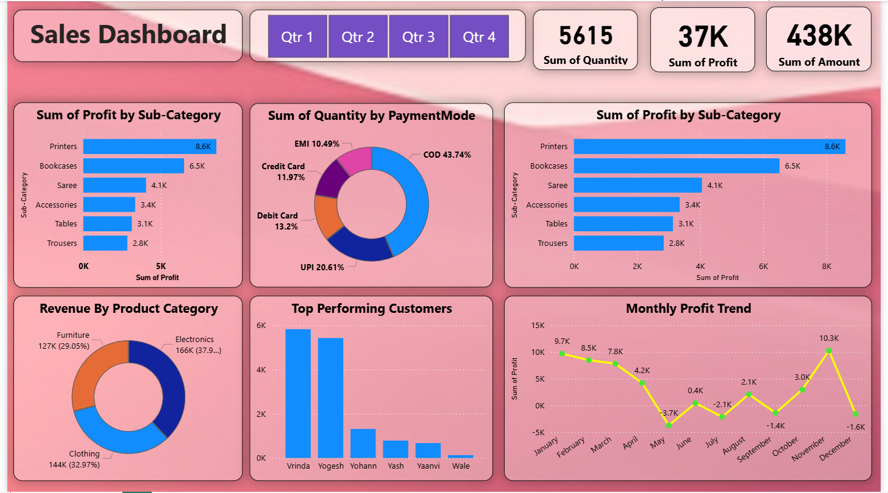
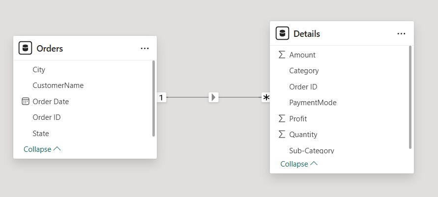

# 📊 Sales Dashboard (Power BI)

## 📌 Overview

This project presents an interactive **Sales Dashboard** built using **Power BI**, designed to analyze sales performance, customer trends, and profitability across different dimensions.

The dashboard provides insights into:

* Sales and profit trends
* Product category performance
* Customer contribution
* Payment mode distribution

---

## 📁 Repository Structure

```
sales-dashboard-project/
│
├── assets/
│   ├── sales_dashboard.png
│   ├── data_model.png
│
├── data/
│   ├── orders.csv
│   ├── details.csv
│
├── reports/
│   └── Sales_Insights_Dashboard.pbix
│
├── README.md
```

---

## 📊 Dashboard Preview



---

## 🧩 Data Model



The data model consists of:

* **Orders Table**

  * City, Customer Name, Order Date, Order ID, State
* **Details Table**

  * Amount, Profit, Quantity, Category, Sub-Category, Payment Mode

Relationship:

* One-to-Many relationship between **Orders** and **Details** via `Order ID`

---

## 📈 Key Insights

* **Total Quantity Sold:** 5615
* **Total Profit:** 37K
* **Total Sales Amount:** 438K

### 🔹 Profit by Sub-Category

* Printers generate the highest profit
* Bookcases and Sarees follow as strong contributors

### 🔹 Payment Mode Analysis

* COD dominates (~44%)
* UPI and Debit Card are also widely used

### 🔹 Monthly Profit Trend

* Peak performance in **December**
* Loss observed in **May, July, and October**

### 🔹 Top Customers

* Vrinda and Yogesh are the highest contributors

---

## 🛠 Tools & Technologies

* **Power BI**
* **Data Modeling**
* **DAX (Data Analysis Expressions)**
* **Data Visualization**

---

## 🚀 How to Use

1. Download the `.pbix` file from the `reports/` folder
2. Open it using **Power BI Desktop**
3. Refresh data if needed
4. Explore interactive visuals and filters

---

## 📌 Features

* Interactive filters (Quarter-wise selection)
* KPI cards for quick insights
* Trend analysis with monthly breakdown
* Category and customer-level deep dive

---

## 📬 Contact

If you have any feedback or suggestions, feel free to connect!

🔗 [LinkedIn Profile](https://www.linkedin.com/in/neelesh-kumar-pandey)
---

⭐ If you like this project, consider giving it a star!
